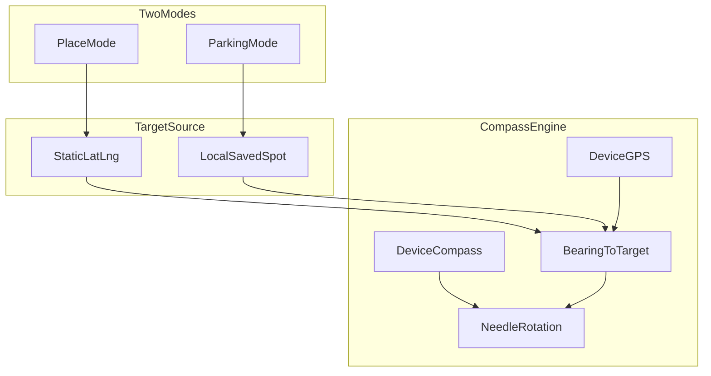

# AnywhereCompass — Hackathon Plan

## Concept

**Problem:** Navigation apps show maps, turn lists, and dashboards. Sometimes you just want to know *which way* to go—toward a meetup spot or the car you parked three hours ago.

**Solution:** A toy-compass interface. The full screen is always a compass; rotate your phone and the needle points at your target. No map as the main UI. **Client-only** — no backend, no hosted database.

| Mode | Target | Storage |
|------|--------|---------|
| **Place** | Address, pin, or share link | Static lat/lng — `localStorage` + URL |
| **Parking** | Your saved car | `localStorage` only |



## Core math

Given current position `(lat1, lng1)` and target `(lat2, lng2)`:

1. **Bearing to target** — haversine forward azimuth in [`lib/bearing.ts`](lib/bearing.ts)
2. **Device heading** — `DeviceOrientationEvent` (iOS: `webkitCompassHeading`)
3. **Needle angle** = `normalize(bearing - deviceHeading)`

Also show **distance** as a small label under the ring ("240 m" / "1.2 km").

---

## Mode 1: Place

Static destination via address search, map pin, or share link.

**Share URL shape:**

```
/c?mode=place&to=40.7128,-74.0060&name=Meetup%20spot
/c?mode=place&q=Empire+State+Building
```

Opening a link on another phone points that phone at the same spot — no server needed; the target coords are in the URL.

Persist last place target in `localStorage`.

---

## Mode 2: Parking

**User story:** Arrive at venue → one tap "Save my car" → later "Find my car" → compass points back.

### Flow

1. **Save:** "Save my car" — captures current GPS + timestamp (+ optional reverse geocode label)
2. **Store:** `localStorage` only
3. **Find:** Home shows "Find my car" when a spot is saved → compass toward saved coords
4. **Clear:** Long-press or button to clear after you've found the car

**Route:** `/c?mode=parking` reads from `localStorage.parkingSpot`

---

## Home screen (mode picker — not a dashboard)

Two choices only:

```
┌─────────────────────────┐
│     AnywhereCompass     │
│                         │
│   [ Point to a place ]  │
│   [ Save my car     ]   │  ← or "Find my car" if saved
└─────────────────────────┘
```

Tap either → permissions prompt (location + compass) → full-screen compass.

---

## Stack (client-only)

| Layer | Choice | Why |
|-------|--------|-----|
| Framework | **Next.js 15 (App Router) + React + TypeScript** | Your preference |
| Styling | **Tailwind CSS** | Mobile layout + compass art |
| Motion | **Framer Motion** | Smooth needle rotation |
| Maps / geocode | **Mapbox GL JS** (or MapLibre + Nominatim) | Place mode search + pin |
| Persistence | **`localStorage`** | Parking + last place |
| PWA | **`@serwist/next`** | Add-to-homescreen on phones |
| QR | **`qrcode.react`** | Place link sharing |

Deploy to **Vercel** (static + client-side only; HTTPS required for geolocation + motion sensors on iOS).

No Supabase, Turso, SQLite, or API routes for app data.

---

## Project structure

```
app/
  page.tsx              → mode picker home
  c/page.tsx            → compass (mode=place|parking)
  setup/page.tsx        → place mode: search + map pin
components/
  CompassView.tsx
  CompassNeedle.tsx
  ModePicker.tsx
  DestinationPicker.tsx
  MapPinPicker.tsx
  ParkingSaveButton.tsx
  PermissionPrompt.tsx
  ShareTarget.tsx
hooks/
  useGeolocation.ts
  useDeviceOrientation.ts
  useCompassNeedle.ts
lib/
  bearing.ts
  geocode.ts
  target-url.ts
  parking-storage.ts
public/
  manifest.json
```

---

## Critical mobile implementation details

### iOS compass permission
iOS 13+ requires user gesture before motion events:

```ts
if (typeof DeviceOrientationEvent.requestPermission === 'function') {
  await DeviceOrientationEvent.requestPermission();
}
```

### Sensor behavior
- **Geolocation:** `watchPosition` with `{ enableHighAccuracy: true }`
- **Needle:** `requestAnimationFrame` smoothing
- **Fallback:** fixed bearing arrow if compass sensor unavailable

### Map pin + search (Place mode)
- Address autocomplete → `{ lat, lng, name }`
- Map tap → reverse geocode label
- Share link + QR for static places

---

## Environment variables

```
NEXT_PUBLIC_MAPBOX_TOKEN=...   # optional; Nominatim fallback if omitted
```

---

## Hackathon demo script (2 min)

1. **Place:** Search a venue → rotate phone → needle tracks spot
2. **Share:** Copy link / QR → friend opens same target on their phone (both point at the meetup spot)
3. **Parking:** Tap "Save my car" → walk away → "Find my car" → needle points back

Closing line: *"No map. No dashboard. Just which way."*

---

## Scope / priority

1. Compass engine + GPS + device heading (**must ship**)
2. **Parking mode** (localStorage)
3. Place mode: static `?to=lat,lng` link + share/QR
4. Place mode: address search + map pin
5. PWA + haptics + polish

---

## Out of scope

- **Friend Compass** (live mutual pointing) — requires hosted realtime sync; skipping entirely
- Turn-by-turn routing, offline maps, user accounts, background tracking, AR overlay
- Any backend or database

---

## Implementation order

1. Scaffold Next.js + Tailwind + PWA manifest
2. `bearing.ts` + `useGeolocation` + `useDeviceOrientation` + `useCompassNeedle`
3. `CompassView` + `ModePicker` home — validate on real phone over HTTPS early
4. **Parking mode** (localStorage)
5. Place mode: URL params, share/QR, then search + map pin
6. PWA, haptics, demo polish

**Day 1 checkpoint:** Compass needle on a physical phone. **Day 1 end:** Parking + static place link demoable.
